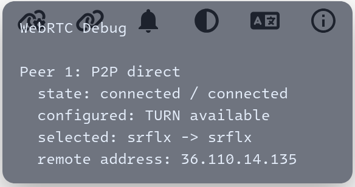

# AP 隔离下的内网互连

> :fontawesome-regular-face-grin: dongdigua
>
> :material-clock-edit-outline: 2026年6月10日 14:00:00

众所周知，咱学校同一 AP 下的设备不能互连，而不同 AP，或者 Wi-Fi 与网线设备之间能。
当手机和电脑在同一间寝室/教室时（显然这很常见）无法通过 LocalSend 互传文件。（用微信/QQ传文件真的很不优雅好吧）

但我发现 `magic-wormhole.rs` 却能做到直链连接，抓包发现是 STUN 打洞连到了学校的出口 IP 然后 NAT 回环再绕回来。
基于 WebRTC 的方案比如 pairdrop 也是通过 NAT 回环直连。

（这也是为什么之前在内网部署 Screego 自带的 STUN 完全没用，因为内网的 STUN 只能返回 peer 的内网 IP）

结论：STUN 必须放到公网。
